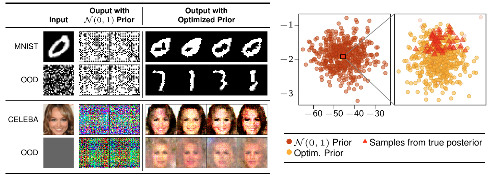

# Model Selection for Bayesian Autoencoders

Code for the paper "Model Selection for Bayesian Autoencoders".



The code is under refactoring, feel free to contact me via email ([ba-hien.tran@eurecom.fr](ba-hien.tran@eurecom.fr)) if you have any issues or questions.

## Dependencies
Run the following command to install necessary python packages for our code

```bash
pip3 install -r requirements.txt
```

## Data

### MNIST
* The MNIST dataset is already supported by the `torchvision.datasets` package.
### Frey-Yale
* The pre-processed Frey and Yale datasets are located in the directories `datasets/FreyFaces` and `datasets/YaleFaces`, respectively.
### CelebA
* Please download the aligned CelebA dataset at [here](http://mmlab.ie.cuhk.edu.hk/projects/CelebA.html), which includes two files: `img_align_celeba.zip` and `list_eval_partition.txt`.
* Then, extract the file `img_align_celeba.zip` under the directory `datasets/celeba/raw`.  The file `list_eval_partition.txt` also should be located in this directory.

## Examples

Here are a few examples to run the BAE model with optimized prior on various datasets:

### MNIST
```bash
python3 experiments/bae_conv_mnist.py \
    --seed=1 \
    --out_dir="./exp/conv_mnist/bae_latent_50_train_200_prior_optim" \
    --prior_dir="./exp/conv_mnist/prior" \
    --samples_per_class=10 \
    --train="True" \
    --prior_type="optim" \
    --training_size=200 \
    --latent_size=50 \
    --optimize_prior="True" \
    --batch_size=64 \
    --n_iters_prior=2000 \
    --lr=0.003 \
    --mdecay=0.05 \
    --num_burn_in_steps=2000 \
    --n_mcmc_samples=32 \
    --keep_every=1000 \
    --only_zero="True" \
    --iter_start_collect=6000
```

### Frey-Yale
```bash
python3 experiments/bae_conv_face.py \
    --seed=1 \
    --out_dir="./exp/conv_face/bae_latent_50_zero_train_500_prior_optim" \
    --prior_dir="./exp/conv_face/prior" \
    --n_epochs_pretrain=200 \
    --prior_type="optim" \
    --training_size=500 \
    --latent_size=50 \
    --optimize_prior="True" \
    --batch_size=64 \
    --n_iters_prior=2000 \
    --lr=0.003 \
    --mdecay=0.05 \
    --num_burn_in_steps=2000 \
    --n_mcmc_samples=32 \
    --keep_every=1000 \
    --iter_start_collect=6000
```

### CelebA
```bash
python3 experiments/bae_conv_celeba.py \
    --seed=1 \
    --out_dir="./exp/conv_celeba/bae_latent_50_train_1000_prior_optim" \
    --prior_dir="./exp/conv_celeba/prior" \
    --prior_type="optim" \
    --train="True" \
    --training_size=1000 \
    --latent_size=50 \
    --optimize_prior="True" \
    --batch_size=64 \
    --n_iters_prior=2000 \
    --lr=0.003 \
    --mdecay=0.05 \
    --num_burn_in_steps=5000 \
    --n_mcmc_samples=32 \
    --keep_every=2000 \
    --iter_start_collect=20000
```

# Notebooks
* We provide some jupyter notebooks used to visualize the results.
These notebooks can be found in the directory `notebooks`.
